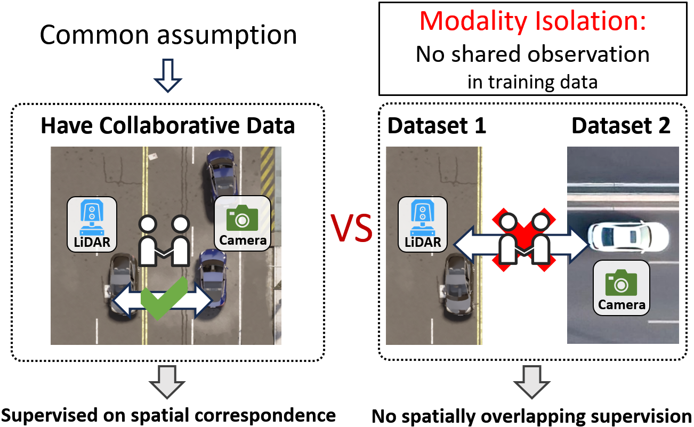
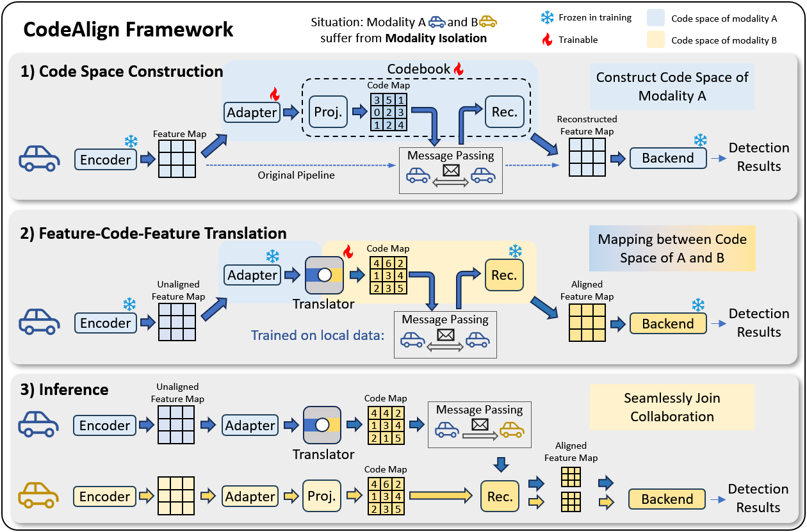

# CodeAlign

Official implementation of **Linking Modality Isolation in Heterogeneous Collaborative Perception**.

Collaborative perception improves each agent's perception capability through multi-agent information exchange. However, heterogeneous agents introduce cross-modal domain gaps, and the paper identifies a further underexplored challenge: **modality isolation**, where agents with different modalities never co-occur in the same training frame. Under this setting, existing alignment methods that depend on spatially overlapping observations cannot directly supervise cross-modal alignment.



To address this, **CodeAlign** is proposed as an efficient, co-occurrence-free alignment framework for heterogeneous collaborative perception. CodeAlign links isolated modalities through cross-modal feature-code-feature (FCF) translation: it first constructs modality-specific code spaces with codebooks, then learns translators that map features into target modality code spaces and decode them back into aligned features.



## Environment

This repository follows the environment setup of [HEAL](https://github.com/yifanlu0227/HEAL). Please refer to the HEAL installation instructions for dependency installation, CUDA/PyTorch setup, and OpenCOOD-style package setup.

## Dataset

Create a `dataset/` folder under the repository root. The main experiments use OPV2V and DAIR-V2X-C:

```text
CodeAlign/
└── dataset/
    ├── OPV2V/
    │   ├── train/
    │   ├── validate/
    │   └── test/
    └── my_dair_v2x/
        └── v2x_c/
            └── cooperative-vehicle-infrastructure/
                ├── train.json
                └── val.json
```

Dataset download references follow HEAL:

| Dataset | Download |
| --- | --- |
| OPV2V | Follow [OpenCOOD](https://github.com/DerrickXuNu/OpenCOOD). HEAL additionally notes that `additional-001.zip` is needed for camera modality data. |
| DAIR-V2X-C | Download from the [DAIR-V2X page](https://thudair.baai.ac.cn/index), and follow the [complemented annotation](https://siheng-chen.github.io/dataset/dair-v2x-c-complemented/) instructions. |
| OPV2V-H | Optional, available on [Hugging Face](https://huggingface.co/datasets/yifanlu/OPV2V-H). |
| V2XSet | Optional, follow [V2X-ViT](https://github.com/DerrickXuNu/v2x-vit). |
| V2X-Sim 2.0 | Optional, download from the [V2X-Sim page](https://ai4ce.github.io/V2X-Sim/) and its accompanying pickle files. |

## Modality Setting

Modality definitions and scenario assignments are stored in:

```text
opencood/modality_assign/
```

Important files include:

```text
opencood/modality_assign/10modality_define.yaml
opencood/modality_assign/10modality_define_codebook16.yaml
opencood/modality_assign/10modality_define_dair.yaml
opencood/modality_assign/opv2v_4modality.json
opencood/modality_assign/opv2v_4modality_in_order.json
```

In the paper setting, `m1` is PointPillar LiDAR, `m2` is SECOND LiDAR, `m3` is VoxelNet LiDAR, `m4/m5` are LiDAR variants, and `m6/m7` are LSS camera variants.

The `opv2v_4modality*.json` files assign vehicle IDs to scenario slots. For CodeAlign experiments, the paper-level modality semantics come from `10modality_define*.yaml`, and each YAML's `heter.mapping_dict` maps those scenario slots to the intended paper modalities.

## Training

Training is mainly controlled by YAML configs. Standard single-process training:

```bash
python opencood/tools/train.py -y ${CONFIG_FILE}
```

Distributed training:

```bash
CUDA_VISIBLE_DEVICES=0,1 python -m torch.distributed.launch \
  --nproc_per_node=2 --use_env \
  opencood/tools/train_ddp.py \
  -y ${CONFIG_FILE}
```

CodeAlign YAML templates are under:

```text
opencood/hypes_yaml/opv2v/Heter_group/codebook/
opencood/hypes_yaml/dairv2x/Heter/
```

A CodeAlign YAML generally contains:

```yaml
root_dir: dataset/OPV2V/train
validate_dir: dataset/OPV2V/validate
test_dir: dataset/OPV2V/test

yaml_parser: load_general_params_heter_group

heter:
  definition_path: opencood/modality_assign/10modality_define.yaml
  assignment_path: opencood/modality_assign/opv2v_4modality.json
  ego_modality: ['m7']
  heter_group: [['m7']]

fusion:
  core_method: intermediateheter

model:
  core_method: heter_codebook_shared_head_c2c
  args:
    only_train_translator: true
    backend_modality: ['m1', 'm6']
    codebook:
      seg_num: 1
      dict_size: 16
      r: 1
    translator:
      core_method: convnext

loss:
  core_method: point_pillar_pyramid_loss

optimizer:
  core_method: Adam
```

Key CodeAlign-specific parameters:

| Parameter | Meaning |
| --- | --- |
| `model.core_method` | Selects the CodeAlign model, e.g. `heter_codebook_shared_head`, `heter_codebook_shared_head_c2c`, or `heter_codebook_shared_head_c2c_infer`. |
| `heter.definition_path` | Modality definition file. |
| `heter.assignment_path` | Vehicle-to-modality assignment for heterogeneous OPV2V evaluation/training. |
| `heter.ego_modality` / `heter.heter_group` | Defines source modalities used in the current training/evaluation stage. |
| `fix_encoder` / `fix_backend` | Freezes pretrained encoder/backbone or backend modules during codebook/alignment training. |
| `aligner` / `aligner_model` | Defines and optionally loads modality-specific aligners. |
| `codebook` | Controls codebook structure, including `seg_num`, `dict_size`, and `r`. |
| `only_train_translator` | Enables CodeAlign stage-2 translator-only training. |
| `backend_modality` / `backend` | Specifies target backend modalities and pretrained backend checkpoints. |
| `translator` | Defines the FCF translator architecture and feature/code shape. |
| `use_coded_feature`, `use_codemap`, `use_d2d` | Ablation switches for different translation/representation variants. |

The typical CodeAlign training flow is:

```text
Stage 0: single-modality pretraining
  train each modality-specific detector independently
  use the resulting single-modality checkpoints as frozen or initialized backends

Stage 1: code space / group formation
  heter_codebook_shared_head
  train aligner + codebook while keeping pretrained perception backend fixed

Stage 2: feature-code-feature translation
  heter_codebook_shared_head_c2c
  load source aligner and target backend/codebooks
  train translator only
```

## Inference

Fixed-order heterogeneous inference, used for the main OPV2V/DAIR-V2X tables:

```bash
CUDA_VISIBLE_DEVICES=0 python opencood/tools/inference_heter_in_order.py \
  --model_dir opencood/logs/path_to_checkpoint \
  --fusion_method intermediate \
  --range 102.4,102.4 \
  --use_cav '[2]'
```

Late fusion:

```bash
CUDA_VISIBLE_DEVICES=0 python opencood/tools/inference_heter_in_order.py \
  --model_dir opencood/logs/path_to_late_checkpoint \
  --fusion_method late \
  --range 102.4,102.4 \
  --use_cav '[2]'
```

Pair-average heterogeneous inference:

```bash
CUDA_VISIBLE_DEVICES=0 python opencood/tools/inference_heter_task_average.py \
  --model_dir opencood/logs/path_to_checkpoint \
  --fusion_method intermediate \
  --range 102.4,102.4
```

Standard homogeneous or single-model inference:

```bash
CUDA_VISIBLE_DEVICES=0 python opencood/tools/inference.py \
  --model_dir opencood/logs/path_to_checkpoint \
  --fusion_method intermediate
```

Noise robustness for fixed-order heterogeneous inference can be evaluated with:

```bash
CUDA_VISIBLE_DEVICES=0 python opencood/tools/inference_heter_in_order.py \
  --model_dir opencood/logs/path_to_checkpoint \
  --fusion_method intermediate \
  --range 102.4,102.4 \
  --use_cav '[2]' \
  --noise 0.2
```

## Acknowledgements

This implementation is based on code from several repositories. We especially thank [HEAL](https://github.com/yifanlu0227/HEAL) for its heterogeneous collaborative perception codebase.

## Citation

If you find this project useful, please cite:

```bibtex
@inproceedings{liu2026linking,
  title={Linking Modality Isolation in Heterogeneous Collaborative Perception},
  author={Liu, Changxing and Chao, Zichen and Chen, Siheng},
  booktitle={Proceedings of the IEEE/CVF Conference on Computer Vision and Pattern Recognition},
  year={2026}
}
```
